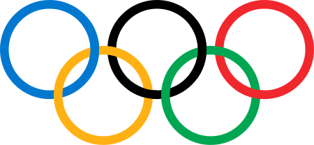

```{r setup, include=FALSE}

knitr::opts_chunk$set(echo = TRUE, warning = FALSE, message = FALSE)

library(tidyverse)
library(plotly)
library(ggplot2)
library(dplyr)
library(patchwork)
library(GGally)
atletas <- read_csv("../Dataset/athlete_events.csv")

```

<br>
  
  <div style="text-align: center;">
  

</div>

<br>

## Introducción
<hr>
Los **Juegos Olímpicos** modernos representan uno de los eventos deportivos más influyentes y de mayor relevancia a nivel mundial. Desde su instauración a finales del siglo XIX y su consolidación a partir de 1900, han reunido a millones de atletas provenientes de todo el mundo, quienes compiten en una amplia variedad de disciplinas. A lo largo de las décadas, los Juegos Olímpicos no solo han sido un escenario para la excelencia deportiva, sino también un reflejo de importantes transformaciones sociales, culturales y políticas a nivel global.

## Descripción del problema

<hr>

En el contexto de los Juegos Olímpicos, resulta de gran interés comprender qué factores podrían estar asociados con el éxito de los atletas, entendido como la obtención de medallas. Cada disciplina deportiva presenta sus propias particularidades, pero se considera que existen variables generales -como la edad, el género, la nacionalidad o la cantidad de participaciones— que podrían influir en el rendimiento. Explorar estas relaciones permite formular hipótesis y generar una visión más completa del perfil de los atletas exitosos.

Este proyecto tiene como propósito realizar un **Análisis Exploratorio de Datos (EDA)** para identificar patrones, distribuciones y posibles relaciones entre variables que ayuden a entender qué factores están vinculados al logro de medallas en los Juegos Olímpicos. A través de visualizaciones interactivas, se busca facilitar la interpretación de los datos y descubrir tendencias significativas que permitan una comprensión más profunda del rendimiento olímpico.

Cabe aclarar que los patrones que se observarán en el siguiente análisis representan tendencias generales observadas en el conjunto completo de disciplinas olímpicas, por lo que los factores de éxito pueden variar significativamente según el deporte específico. Este análisis no busca establecer reglas absolutas, sino identificar características comunes asociadas al rendimiento medallista desde una perspectiva exploratoria.


## Definición de fuente de datos
<hr>
El análisis se basa en el conjunto de datos llamado **“120 years of Olympic history: athletes and results”**, el cual está disponible en la plataforma **Kaggle**. Este dataset contiene información detallada sobre más de 120 años de historia olímpica (1896-2016).

### Variables del dataset
<hr>

<style>

  table.custom-table {
    width: 80%;
    margin: 20px auto;
    border-collapse: collapse;
    font-family: Arial, sans-serif;
    font-size: 14px;
  }

  table.custom-table th,
  table.custom-table td {
    border: 1px solid #ccc;
    padding: 10px 15px;
    text-align: left;
  }

  table.custom-table th {
    background-color: #f2f2f2;
  }

  table.custom-table caption {
    caption-side: top;
    font-size: 16px;
    font-weight: bold;
    margin-bottom: 10px;
  }
  
</style>

<table class="custom-table">
  <thead>
    <tr>
      <th>Campo</th>
      <th>Descripción</th>
    </tr>
  </thead>
  <tbody>
    <tr><td>ID</td><td>Número único asignado a cada registro de atleta en los Juegos Olímpicos.</td></tr>
    <tr><td>Name</td><td>Nombre completo del atleta que participó en los Juegos Olímpicos.</td></tr>
    <tr><td>Sex</td><td>Sexo del atleta, representado por "M" para masculino o "F" para femenino.</td></tr>
    <tr><td>Age</td><td>Edad del atleta al momento de participar en los Juegos Olímpicos.</td></tr>
    <tr><td>Height</td><td>Altura del atleta en centímetros.</td></tr>
    <tr><td>Weight</td><td>Peso del atleta en kilogramos.</td></tr>
    <tr><td>Team</td><td>Nombre del equipo del atleta, que corresponde al país o delegación a la que representa.</td></tr>
    <tr><td>NOC</td><td>El código de tres letras del Comité Olímpico Nacional (NOC) del país del atleta.</td></tr>
    <tr><td>Games</td><td>Año y temporada en la que se celebraron los Juegos Olímpicos (por ejemplo, 2008 Summer o 2016 Winter).</td></tr>
    <tr><td>Year</td><td>Año en que se celebraron los Juegos Olímpicos, expresado como un número entero.</td></tr>
    <tr><td>Season</td><td>Temporada de los Juegos Olímpicos: "Summer" (Verano) o "Winter" (Invierno).</td></tr>
    <tr><td>City</td><td>Ciudad en la que se celebraron los Juegos Olímpicos.</td></tr>
    <tr><td>Sport</td><td>Deporte en el que el atleta participó, por ejemplo, Atletismo, Natación, Gimnasia, etc.</td></tr>
    <tr><td>Event</td><td>Evento específico dentro de un deporte, como 100m planos, salto de altura, etc.</td></tr>
    <tr><td>Medal</td><td>Indica si el atleta obtuvo una medalla: "Gold" (Oro), "Silver" (Plata), "Bronze" (Bronce), o "NA" (No aplicable, si no ganó medalla).</td></tr>
  </tbody>
</table>

<div style="text-align: center; margin: 20px;">
  <p>Obtenido desde: <a href="https://www.kaggle.com/datasets/heesoo37/120-years-of-olympic-history-athletes-and-results" target="_blank">120 years of Olympic History Dataset - Kaggle</a></p>
</div>

<br>

## Visualizaciones y análisis
<hr>

A continuación, se presentará una serie de visualizaciones que exploran distintas variables del conjunto de datos. Cada gráfico irá acompañado de un breve análisis interpretativo que servirá para guiar al lector en la comprensión de los resultados del Análisis Exploratorio de Datos (EDA). Es importante aclarar que cada visualización ha sido seleccionada con el propósito de identificar posibles factores generales que aumenten la probabilidad de éxito de un atleta. Del mismo modo, los análisis serán de carácter general y se profundizará en la relación específica con la problemática planteada en la sección de conclusiones.

### Análisis univariado

<hr>

En esta sección, exploraremos algunas de las variables más interesantes del conjunto de datos a través de gráficos univariable. Estos gráficos nos permitirán comprender mejor la distribución de los datos en términos de **atributos individuales**, sin considerar las relaciones entre variables. Los tres gráficos que se presentarán a continuación destacan patrones significativos y tendencias en aspectos clave de los atletas olímpicos.

<br>
  
1. **Frecuencia** de participación por deporte.

2. Distribución de **edades** de los atletas.

3. Distribución del **peso** de los atletas.

<br>

#### Frecuencia de participación por deporte

<hr>

```{r unidimensional1, echo=FALSE}

deportes_data <- atletas %>%
  filter(!is.na(Sport)) %>%
  count(Sport, name = "Participaciones") %>%
  arrange(desc(Participaciones)) %>%
  top_n(25, Participaciones)  

grafico_deportes <- ggplot(deportes_data, aes(x = reorder(Sport, Participaciones), y = Participaciones, fill = Sport)) +
  geom_col(show.legend = FALSE) +
  coord_flip() +
  labs(x = "", y = "") +
  theme_minimal()

plotly::ggplotly(grafico_deportes)

```

<br>

En la gráfica se puede observar que disciplinas como el atletismo, la gimnasia y la natación destacan notablemente, liderando el número de eventos y atletas participantes. Esto se debe a la variedad de pruebas que componen estas disciplinas (como carreras, saltos, estilos de nado o tipos de gimnasia), así como a su fuerte tradición en los Juegos Olímpicos desde sus inicios.

De manera similar, otros deportes como el ciclismo, la esgrima y el tiro, aunque con menos disciplinas internas, han mantenido una presencia constante a lo largo de numerosas ediciones de los Juegos Olímpicos. Este patrón refleja no solo la popularidad histórica de ciertos deportes, sino también la estructura del programa olímpico, que favorece a disciplinas con múltiples eventos y un acceso amplio para atletas de diversas categorías. 

<br>

#### Distribución de edades de los atletas

<hr>

```{r unidimensional2, echo=FALSE}

edades_data <- atletas %>%
  filter(!is.na(Age), Age > 0, Age < 100)

grafico_edades <- ggplot(edades_data, aes(x = Age)) +
  geom_histogram(bins = 30, fill = "#69b3a2", color = "black", alpha = 0.7) +
  labs(title = "", x = "", y = "") +
  theme_minimal()

plotly::ggplotly(grafico_edades)

```

<br>

En el gráfico anterior se visualiza la distribución de edades de los atletas olímpicos. La mayoría de los participantes está entre los 20 y 30 años, lo cual es esperable considerando que muchas disciplinas deportivas exigen un alto rendimiento físico, propio de esta etapa de la vida. También se observan algunas participaciones fuera de ese rango, aunque en menor proporción, lo que sugiere la existencia de deportes donde los atletas pueden competir a edades más tempranas o avanzadas, lo que nos indica que hay deportes olímpicos donde el rendimeinto físico no es lo más importante. 

<br>

#### Distribución del peso de los atletas

<hr>

```{r unidimensional3, echo=FALSE}

peso_data <- atletas %>%
  filter(!is.na(Weight) & Weight > 0)

grafico_densidad_peso <- ggplot(peso_data, aes(x = Weight)) +
  geom_density(fill = "#D95F02", alpha = 0.7) +
  labs(x = "Peso (kg)", y = "Densidad") +
  theme_minimal()

plotly::ggplotly(grafico_densidad_peso)

```

<br>

El gráfico anterior muestra la distribución del peso de los atletas a lo largo de la historia olímpica. La curva presenta un pico pronunciado entre los 60 y 80 kg, lo que indica que una gran parte de los deportistas se concentra en ese rango. Sin embargo, también se observa una dispersión considerable hacia ambos extremos, reflejando la diversidad de requerimientos físicos según la disciplina deportiva. Lo anterior denota que existe una gran diversidad en los deportes y en los requerimientos de cada uno.

<br>

### Análisis bivariado

<hr>

En esta sección, examinaremos relaciones entre **pares** de variables para descubrir patrones, correlaciones o diferencias relevantes dentro del conjunto de datos. El análisis bivariado nos permite entender cómo se comportan dos variables en conjunto, que clave para identificar tendencias más profundas y contextos específicos.
  
<br>  
  
1. Número de **participaciones** vs la obtención de **medallas**.

2. Cantidad de **medallas** ganadas por **país**.

<br>

#### Participación por sexo a lo largo del tiempo

<hr>

```{r bidimensional1, echo=FALSE}

# Crear una tabla que tenga una fila por atleta y año
participaciones <- atletas %>%
  filter(!is.na(Year), !is.na(ID)) %>% # Nos aseguramos de no tener datos faltantes
  distinct(ID, Year, Medal) %>% # Nos quedamos con una fila por atleta-año-medalla
  group_by(ID) %>% # Agrupamos por atleta
  summarise(
    Participaciones = n_distinct(Year), # Contamos cuántos años distintos participó cada atleta
    GanoMedalla = any(Medal %in% c("Gold", "Silver", "Bronze")) # TRUE si ganó al menos una medalla
  )

# Agrupar por número de participaciones para calcular proporciones
resumen <- participaciones %>%
  group_by(Participaciones) %>% # Agrupamos por cantidad de participaciones
  summarise(
    Total_Atletas = n(), # Total de atletas con esa cantidad de participaciones
    Con_Medalla = sum(GanoMedalla), # Cuántos ganaron al menos una medalla
    Proporcion_Exito = Con_Medalla / Total_Atletas # Proporción de éxito (de 0 a 1)
  )

# Crear la gráfica
grafico <- ggplot(resumen, aes(x = Participaciones, y = Proporcion_Exito)) +
  geom_line(color = "#2E86C1", size = 1.2) +
  geom_point(color = "#117A65", size = 2) + # Puntos sobre la línea
  labs(
    x = "Número de participaciones",
    y = "Proporción de atletas con al menos una medalla",
  ) +
  theme_minimal()                                       

ggplotly(grafico)
 
```

<br>

En el gráfico anterior se analiza la relación entre la experiencia olímpica de los atletas (medida por el número de participaciones) y la probabilidad de haber ganado al menos una medalla. Se observa una tendencia creciente: a mayor número de participaciones, mayor es la proporción de atletas que han conseguido al menos una medalla.

Sin embargo, también es importante considerar que esta relación no implica directamente el éxito, ya que los atletas que logran buenos resultados tienden a ser seleccionados nuevamente, lo que refuerza su presencia en múltiples ediciones. Aun así, el patrón encontrado sugiere que la continuidad y la persistencia en el alto rendimiento pueden ser factores clave al menos de forma general.

<br>

#### Cantidad de medallas ganadas por país

```{r bidimensional2, echo=FALSE}

medallas_por_noc <- atletas %>%
  filter(!is.na(Medal)) %>%
  count(NOC, name = "Medallas") %>%
  arrange(desc(Medallas)) %>%
  top_n(20, Medallas)  

grafico_medallas <- ggplot(medallas_por_noc, aes(x = reorder(NOC, Medallas), y = Medallas, fill = NOC)) +
  geom_col(show.legend = FALSE) +
  coord_flip() +
  labs(x = "NOC (País)", y = "Cantidad de medallas") +
  theme_minimal()

plotly::ggplotly(grafico_medallas)

```

<br>

Se pueden ver los 20 Comités Olímpicos Nacionales (NOC) con mayor cantidad de medallas obtenidas a lo largo de la historia de los Juegos. Se nota que hay una marcada concentración de medallas en un pequeño grupo de países, destacando especialmente potencias deportivas como Estados Unidos, Rusia, Alemania o Reino Unido.

Esta concentración refleja no solo el alto rendimiento de estos países en múltiples disciplinas, sino también factores como la inversión en infraestructura deportiva, el desarrollo de programas de alto rendimiento y la participación constante en las ediciones olímpicas.

<br>

### Análisis Multidimensional 

<hr>

En esta sección, se integrarán múltiples variables en una única visualización con el propósito de identificar patrones complejos. Esta técnica resulta útil cuando se desea examinar cómo diferentes características interactúan entre sí y cómo influyen de manera simultánea en los resultados, en este caso, la obtención de medallas. 

<br>

* **Relación** entre características físicas y experiencia entre atletas medallistas (general).

<br>

### Relación entre características físicas y experiencia entre atletas medallistas

<hr>

```{r multidimensional, echo=FALSE}

atletas_proc <- atletas %>%
  filter(!is.na(Age), !is.na(Height), !is.na(Weight)) %>%
  group_by(ID) %>%
  summarise(
    Edad = first(Age),
    Estatura = first(Height),
    Peso = first(Weight),
    Participaciones = n(),
    Medalla = ifelse(any(!is.na(Medal)), "Sí", "No"),
    NOC = first(NOC),
    .groups = "drop"
  )

con_medalla <- atletas_proc %>% filter(Medalla == "Sí") %>% sample_n(30)
sin_medalla <- atletas_proc %>% filter(Medalla == "No") %>% sample_n(30)
muestra_balanceada <- bind_rows(con_medalla, sin_medalla)

muestra_balanceada$NOC <- as.factor(muestra_balanceada$NOC)

grafico <- ggparcoord(
  data = muestra_balanceada,
  columns = 2:5,                
  groupColumn = 6,              
  scale = "uniminmax",
  showPoints = TRUE,
  alphaLines = 0.5
) +
  scale_color_manual(
    values = c("Sí" = "#DAA520", "No" = "#A9A9A9"),
    name = "¿Ganó medalla?"
  ) +
  labs(
    x = "Variables",
    y = "Escala Normalizada"
  ) +
  theme_minimal(base_size = 13)

ggplotly(grafico, tooltip = c("colour", "x", "y", "text")) %>%
  style(
    text = paste("NOC:", muestra_balanceada$NOC)
  )

```

<br>

La gráfica presenta una comparación entre 60 atletas seleccionados aleatoriamente del conjunto de datos, divididos equitativamente entre medallistas y no medallistas. Se observa que los atletas que obtuvieron medallas tienden a mostrar características físicas (edad, estatura y peso) levemente más centralizadas, aunque con una alta dispersión general en los valores, probablemente debido a la diversidad de disciplinas y países presentes en la muestra. Además, se evidencia una ligera tendencia a una mayor cantidad de participaciones entre los medallistas, lo que sugiere que la experiencia podría jugar un papel relevante en el logro de resultados.

Si bien las diferencias físicas generales entre ambos grupos no son marcadas, destaca el hecho de que la mayoría de los medallistas pertenecen a países con tradición deportiva sólida y fuerte presencia olímpica. Este contraste refuerza la idea de que, más allá de las cualidades físicas, existen otros factores determinantes en el rendimiento olímpico, como la preparación, el apoyo institucional, la infraestructura deportiva y el contexto competitivo, que pueden influir significativamente en el éxito de un atleta.

<br>

### Análisis facético

<hr>

En esta sección se implementará una gráfica de facetas para un grupo de variables categóricas, en este caso utilizaremos la variable NOC para comparar el desempeño medallista de los atletas de las principales potencias olímpicas mundiales.

<br>

* **Comparación** mediante facetas: Medallas obtenidas por año.

<br>

#### Comparación mediante facetas: Medallas obtenidas por año.

```{r facetas_medallas, echo=FALSE, fig.width=10, fig.height=6}

faceta_medallas <- atletas %>%
  filter(!is.na(Medal), 
         NOC %in% c("USA", "RUS", "CHN", "GBR", "GER")) %>%
  group_by(Year, Medal, NOC) %>%
  summarise(Atletas = n(), .groups = "drop")

grafico_medallas_facetas <- ggplot(faceta_medallas, aes(x = Year, y = Atletas, fill = Medal)) +
  geom_col(position = "stack") +
  facet_wrap(~NOC, ncol = 3) +
  scale_fill_manual(
    values = c("Gold" = "#FFD700", "Silver" = "#C0C0C0", "Bronze" = "#CD7F32"),
    name = "Tipo de medalla"
  ) + 
  labs(
    x = "",
    y = "Cantidad de medallistas"
  ) +
  theme_minimal(base_size = 13) +
  theme(
    axis.text.x = element_text(angle = 45, hjust = 1),
    legend.position = "bottom"
  )

plotly::ggplotly(grafico_medallas_facetas)

```

<br>

Este gráfico muestra la evolución del número de medallistas en los Juegos Olímpicos para cinco potencias deportivas (EE.UU., Rusia, China, Reino Unido y Alemania), desglosado por tipo de medalla (oro, plata y bronce). Cada facet corresponde a un país, y dentro de ellos se observa la cantidad total de atletas que obtuvieron medalla en cada edición olímpica. El uso del modo stack por tipo de medalla permite comparar no solo el volumen total de medallistas por año, sino también la distribución entre los diferentes tipos de premios.

Podemos notar que Estados Unidos destaca con una mayor cantidad de medallistas en casi todos los años, especialmente en las medallas de oro, lo cual confirma su dominio histórico en el medallero. Otros países como China y Rusia también muestran picos importantes, aunque con más variabilidad entre años. El gráfico es útil para identificar tendencias en el rendimiento olímpico nacional, como el aumento de medallistas chinos después del año 2000 o el descenso de Alemania. En conjunto, permite observar cómo se reparte el éxito olímpico entre estos países y cómo ha evolucionado con el tiempo.

<br>

### Imagen compuestada

<hr>

A continuación se presentará una imagen compuesta (gráfico de gráficos) en donde se tratan diversas variables categorizadas por el sexo del atleta.

<br>

1. **Participación** por sexo a lo largo del tiempo. 
2. **Distribucion** de edades para cada sexo.
3. **Distribución** de pesos para atletas de halterofilia.
4. **Distribución** de pesos para atletas de gimnasia.

<br>

#### Gráfica compuesta

```{r compuesta, echo=FALSE}

base <- atletas %>%
  filter(!is.na(Year), !is.na(Sex), !is.na(Age), !is.na(Medal))

# Evolución de atletas por sexo
g1 <- base %>%
  group_by(Year, Sex) %>%
  summarise(Cantidad = n(), .groups = "drop") %>%
  ggplot(aes(x = Year, y = Cantidad, color = Sex)) +
  geom_line(size = 1.2) +
  labs(x = "Año", y = "Cantidad") +
  theme_minimal(base_size = 12) +
  theme(plot.title = element_text(hjust = 0.5))

# Scatterplot reducido sexo vs edad
muestra_scatter <- base %>% sample_n(500)

g2 <- ggplot(muestra_scatter, aes(x = Sex, y = Age, color = Sex, text = paste("Edad:", Age))) +
  geom_jitter(alpha = 0.5, width = 0.2) +
  labs(x = "Sexo", y = "Edad") +
  theme_minimal(base_size = 12) +
  theme(plot.title = element_text(hjust = 0.5))

# Densidad del peso en halterofilia
halterofilia <- atletas %>%
  filter(Sport == "Weightlifting", !is.na(Weight), !is.na(Sex))

g3 <- ggplot(halterofilia, aes(x = Weight, fill = Sex, color = Sex)) +
  geom_density(alpha = 0.5) +
  labs(x = "Peso (kg)", y = "Densidad") +
  theme_minimal(base_size = 12) +
  theme(plot.title = element_text(hjust = 0.5))

# Histograma del peso en gimnasia 
gimnasia <- atletas %>%
  filter(Sport == "Gymnastics", !is.na(Weight), !is.na(Sex))

g4 <- ggplot(gimnasia, aes(x = Weight, fill = Sex)) +
  geom_histogram(binwidth = 2, position = "dodge", alpha = 0.7) +
  labs(x = "Peso (kg)", y = "Cantidad") +
  theme_minimal(base_size = 12) +
  theme(plot.title = element_text(hjust = 0.5))

p1 <- ggplotly(g1)
p2 <- ggplotly(g2, tooltip = c("x", "y", "text"))
p3 <- ggplotly(g3)
p4 <- ggplotly(g4)

subplot(p1, p2, p3, p4, nrows = 2, margin = 0.15,   titleX = TRUE, titleY = TRUE)

```

<br>

De la imagen compuesta se pueden analizar diversos patrones derivados de cada uno de los tipos de gráfico que la componen, sin embargo todas analizan un comportamiento de los datos con base al sexo del atleta.

<br>

1. La primera gráfica muestra como ha evolucionado la participación de atletas desde los inicios de estos Juegos. Se puede visualizar cómo la participación de ambos sexos fue creciendo progresivamente, sin embargo, el cambio más abrupto se da en la participación femenina, ya que principalmente a mediados del siglo XX se presenta un alza considerable en su participación, lo que implícitamente denota cambios sociales y culturales propios de la época. Actualmente se ve una participación mucho más equitativa.

2. Del segundo gráfico se toma una muestra de 500 atletas aleatorios y se puede notar que los atletas masculinos (de manera general) llegan a participar en los juegos a edades más avanzadas y distribuidas a comparación con las mujeres, cuyas edades se agrupan en un intervalo más cerrado.

3. Para el deporte de halterofilia (tercer gráfico) se esperan atletas algo pesados para ambos generos, esto debido a la fuerza que deben aplicar en su respectiva disciplina, y así se muestra en el gráfico. Para el sexo masculino se nota una distribución de pesos más amplia, aunque la mayoría se concentra entre los 70 y 85 kilogramos, mientras que las mujeres concentran la mayoría de los pesos entre los 70 y 80 kilogramos. La variabilidad de pesos radica en las múltiples modalidades que existe en este deporte.

4. Para el deporte de la gimnasia (cuarto gráfico) se esperan atletas ágiles y ligeros para ambos sexos, esto debido a la rapidez que necesitan al aplicar sus maniobras, y efectivamente así lo muestra el gráfico distribuyendo los pesos entre los 40 y 60 kilogramos para las mujeres y entre 55 y 80 kilogramos para los hombres

<br>

## Conclusiones

<hr>

Si bien el éxito de un atleta depende de **numerosos factores** (incluidos muchos ajenos al ámbito deportivo), el análisis exploratorio del conjunto de datos “120 years of Olympic history: athletes and results” permitió identificar y confirmar patrones que, de forma general, pueden estar relacionados con la obtención de una medalla. Cada visualización aportó no solo información sobre posibles factores de éxito, sino también estadísticas con fuerte carga histórica, social y cultural, lo que convierte a este dataset en una fuente valiosa para múltiples enfoques de análisis.

A través del análisis univariado se identificaron tendencias generales en el conjunto de datos. En primer lugar, se recopilaron los **deportes con mayor participación**, y se concluyó que su alta densidad poblacional se debe a la existencia de múltiples disciplinas dentro de cada uno. Esto sugiere que un atleta que compite en este tipo de deportes tiene la posibilidad de participar en varias pruebas, aumentando así, de forma estadística, sus probabilidades de éxito. Por otro lado, se analizó de manera general el **peso** y la **edad** de los atletas, encontrando que ambos parámetros tienden a concentrarse en intervalos específicos. Esto refleja que el rendimiento físico óptimo suele alcanzarse dentro de ciertos rangos de peso y edad, lo cual sugiere, nuevamente de forma implícita, que estas variables desempeñan un papel importante en el desempeño y éxito de un atleta olímpico.


El análisis bivariado permitió identificar la **experiencia** como un factor relevante en la probabilidad de que un atleta obtenga una medalla. Se observó que, a mayor número de participaciones en los Juegos Olímpicos, mayor es la posibilidad de alcanzar el podio. Asimismo, se evidenció que los países con mayor número de medallas suelen ser las principales potencias mundiales, lo que sugiere que **uno de los factores más determinantes en el éxito olímpico es la infraestructura deportiva, así como los recursos y el apoyo brindado por el comité olímpico nacional de cada país**.

Gracias al análisis multidimensional (mediante una muestra del dataset) se pudieron ver de manera muy general, las **relaciones** entre peso, altura, edad y cantidad de participaciones diferenciando por color a los atletas que ganaron y no ganaron una medalla. Si bien no se observó un patrón determinante entre los ganadores y no ganadores (probablemente debido a lo general de los datos), se logró reafirmar la idea de que las NOC (comités nacionales) y la experiencia son factores de éxito muy generales.

El análisis facético permitió un examen más detallado de la **distribución de medallas**  en cada una de las potencias deportivas seleccionadas, revelando no solo el volumen total de medallistas a lo largo del tiempo, sino también cómo se han comportado individualmente en distintas ediciones olímpicas. Este enfoque puntual facilitó la identificación de patrones únicos en cada país y reforzó la idea de que el éxito olímpico responde a procesos históricos, estratégicos y estructurales propios de cada nación.

La imagen compuesta permitió identificar patrones generales en torno a la participación y características físicas de los atletas olímpicos, **diferenciando por sexo**. Se observó un aumento progresivo en la participación femenina a lo largo del tiempo, reflejo de cambios sociales y culturales. En cuanto a la edad, los hombres tienden a competir en rangos más amplios, mientras que las mujeres se agrupan en intervalos más definidos. El análisis por deporte confirma que disciplinas como la halterofilia presentan atletas con mayor peso, mientras que en gimnasia predominan cuerpos más ligeros, en ambos casos con diferencias por sexo que responden a las exigencias de cada actividad. En conjunto, la imagen evidenció cómo el sexo del atleta influye en distintas variables relacionadas con el rendimiento, participación y preparación dentro del contexto olímpico.

En conjunto, este análisis exploratorio permitió comprender con mayor profundidad las múltiples dimensiones que rodean el desempeño olímpico. Aunque ningún factor por sí solo garantiza el éxito, variables como el sexo, la edad, el peso, la experiencia y el país de origen del atleta muestran una influencia significativa en los resultados. Además, el estudio deja en evidencia la riqueza histórica y social del dataset, lo que lo convierte en una herramienta valiosa no solo para el análisis deportivo, sino también para investigaciones con enfoques culturales, sociológicos y de desarrollo deportivo a nivel global.

